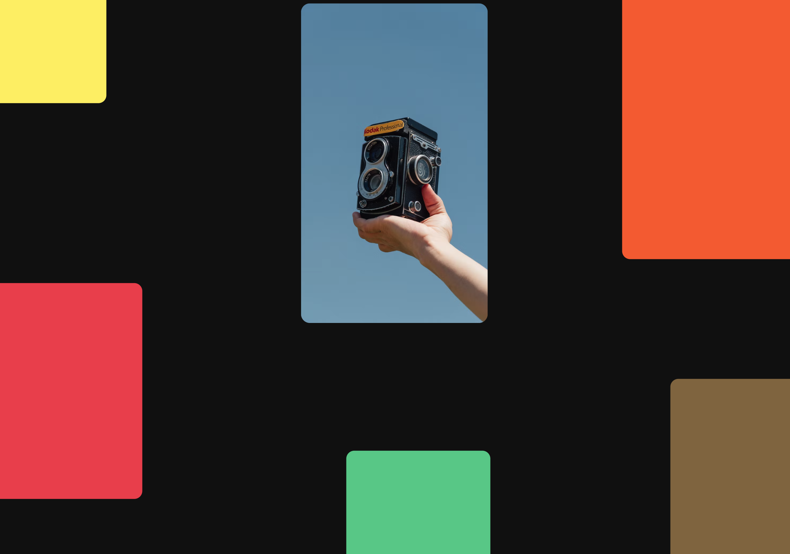
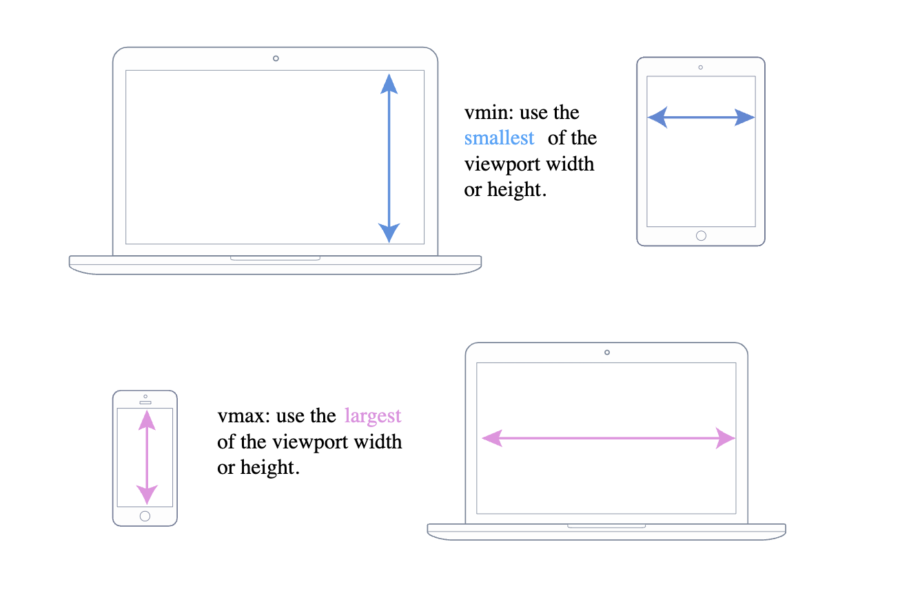
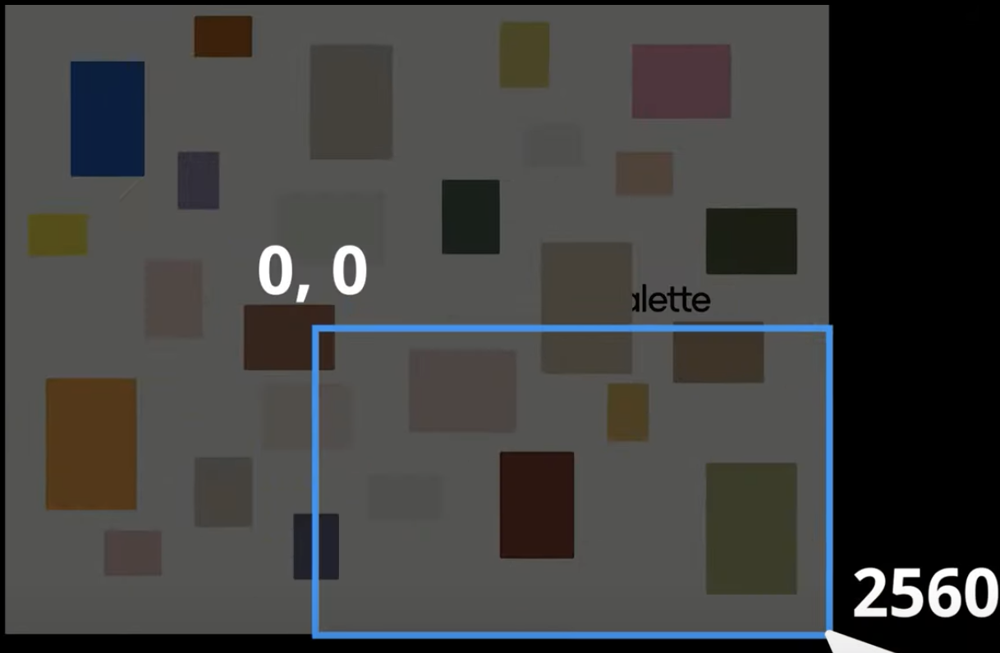
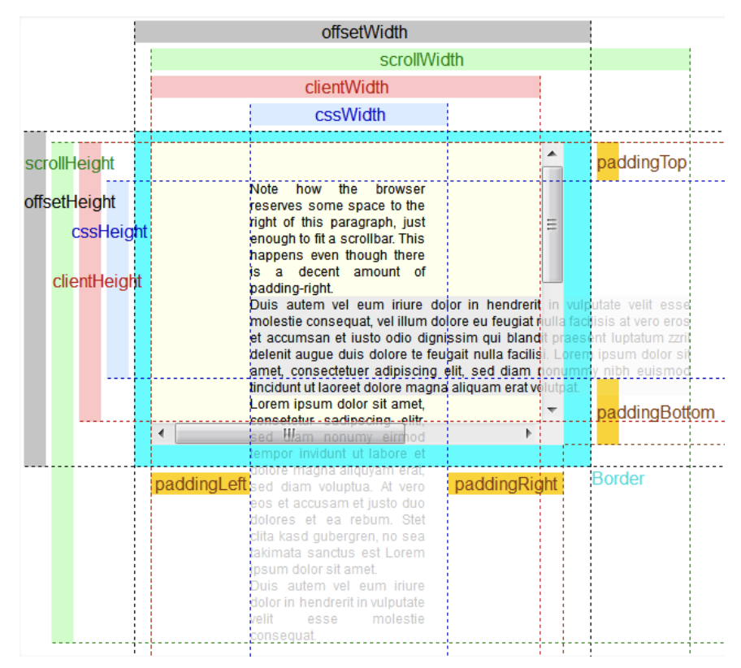

## Wonderful Mr Panoramic

> Panning across absolutely positioned canvas of images 📷.



Featuring:

- Each tile/square is positioned absolutely within a bigger wrapper container

```html
<!-- this `wrapper` expands past your visible screen/view -->
<div id="wrapper">
  <div class="tile"></div>
  <div class="tile"></div>
  <div class="tile"></div>
  <div class="tile"></div>
  <div class="tile"></div>
  <div class="tile"></div>
  <div class="tile"></div>
  <div class="tile"></div>
  <div class="tile"></div>
  <div class="tile"></div>
</div>
```

- The bigger `wrapper` is absolute and x2 the size of the visible window
- Set the little baby tiles free 🕊️ across the wrapper/gallery

`1vh` is equal to 1% of the current viewport height (the open browser window),
while `1vw` is 1% of the current viewport width. But the problem using them can
lead to the right touch of responsive design toward aspect ratio of the screen.
Now `vmin` & `vmax` use those same units, BUT have particular rules:

`vmin` uses the ratio of the "smallest-side"

If height of the browser window is less than its width then a `1vmin` unit will
equivalent to `1vh`. If this width is less than it’s height, `1vmin` is `1vw`.

`vmax` is the opposite: it uses the "largest-side"

So `1vmax` is equivalent to `1vw` if the viewport is wider than it is tall, and
if the browser is taller than it is wide, `1vmax` will be equivalent to `1vh`.



http://thenewcode.com/1137/MinMaxing-Understanding-vMin-and-vMax-in-CSS

```css
body {
  background-color: rgb(10, 10, 10);
  height: 100vh;
  margin: 0px;
  overflow: hidden; /* toggle to see what we hiding 🤫 */
}
#wrapper {
  /* vmax with absolute position is important */
  height: 150vmax;
  width: 150vmax;
  position: absolute;
}
.tile {
  position: absolute; /* Free 🕊️! Freeeeee! */
  border-radius: 1vmax;
  transition: transform 800ms ease;
}
```

- How do we move/pan our window into "panable areas" of the wrapper

If pointer is at position 0, 0 "upper/left" corner the panable wrapper should be
also at that position 0, 0 "upper/left" corner. In turn, if the pointer is at a
"lower/right" corner the panable area should do the same example 2560, 1440.



The logic required is the x and y position of the mouse from pixel value into a
useful decimal value so a operation/event can "shift" the position of the parent
wrapper by a percentage. For example { x: 1643px } = 0.64 & { y: 769px } = 0.53.
After storing our (extended) wrapper in a variable, add a listener to the window
for mouse movement grabbing the { x: ? } & { y: ? } from its `event` object. By
dividing the current x and y position of the pointer by `/` the width and height
the current `window`, we determining the equivalent decimal/fraction value.

https://stackoverflow.com/questions/21064101/understanding-offsetwidth-clientwidth-scrollwidth-and-height-respectively

While the browser uses the values from your CSS to draw boxes, determine all the
dimensions, its not straight-forward in JS land, if you only have the CSS 🤔.
That's why each element has six DOM properties for your convenience:

`offsetWidth`, `offsetHeight`, `clientWidth`, `clientHeight`, `scrollWidth` and `scrollHeight`. These are (read-only) attributes representing the current visual
layout, and all of them are integers. We use the offsets.



```js
const gallery = document.getElementById("wrapper");

window.onmousemove = (e) => {
  console.log(``);
  // Global `window` object these properties represent your browser page
  const windowX = window.innerWidth,
    windowY = window.innerHeight;
  console.log("window: ", { windowX, windowY }); // {windowX: 1366, windowY: 768}

  // Mouse pointer position, your current pointer in `px`
  const pointerX = e.clientX,
    pointerY = e.clientY;
  console.log({ pointerX, pointerY }); // {pointerX: 1366, pointerY: 768} (bottom/right)

  // We use our pointer position to determine its decimal value. Next, we
  // land up `*` multiplying these values negatively by max width & height
  // of the gallery, to then transform translate our position in pixels.
  const decimalX = pointerX / windowX,
    decimalY = pointerY / windowY;
  console.log({ decimalX, decimalY }); // {decimalX: 0.9897510980966325, decimalY: 0.9973958333333334}

  // We get the complete/extended gallery "wrapper" size (150vmax h/w)
  const offsetX = gallery.offsetWidth,
    offsetY = gallery.offsetHeight;
  console.log("offset", { offsetX, offsetY }); // {offsetX: 2049, offsetY: 2049}

  // We cutout "leftover" width & height of the window against our offset.
  // It presents remaining distance we can still translate(x, y) toward.
  const boundaryX = offsetX - windowX,
    boundaryY = offsetY - windowY;
  console.log({ boundaryX, boundaryY }); // {boundaryX: 683, boundaryY: 1281}

  // We `*` multiple negatively these values to achieve a panning of the
  // visible viewport in a opposite direct across the x and y axis of the
  // absolutely positioned wrapper, remember it's extended by 150vmax.
  const panX = boundaryX * decimalX * -1,
    panY = boundaryY * decimalY * -1;
  console.log({ panX, panY }); // {panX: -676, panY: -1277.6640625} (bottom/right)

  // Update the css transform of the wrapper's position (are gallery), we
  // panX and panY in `px` pixels and translate our visible position over
  // this bigger gallery container `div` that is absolutely positioned.
  gallery.style.transform = `translate(${panX}px, ${panY}px)`;
};
```

Regards,
Luigi Lupini

I ❤️ all things (🇮🇹 / 🛵 / ☕️ / 👨‍👩‍👧)
